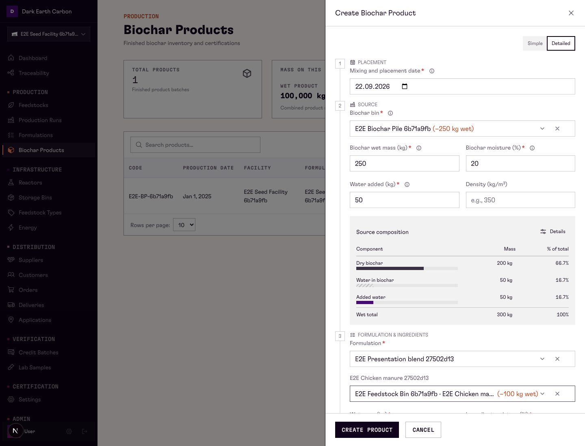
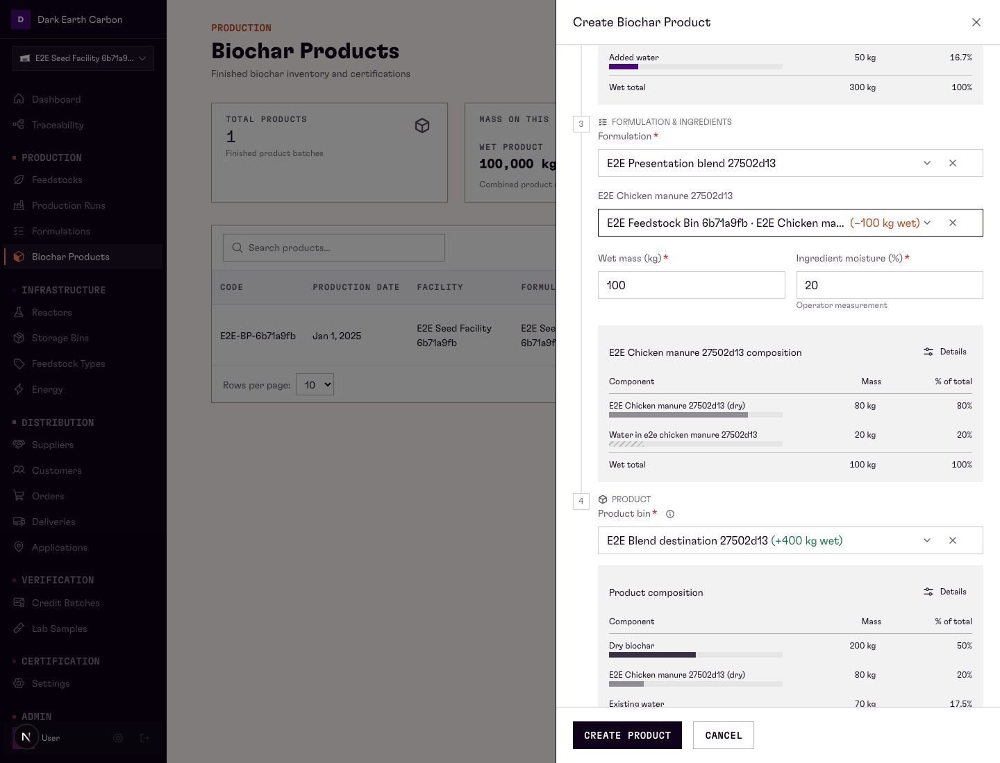
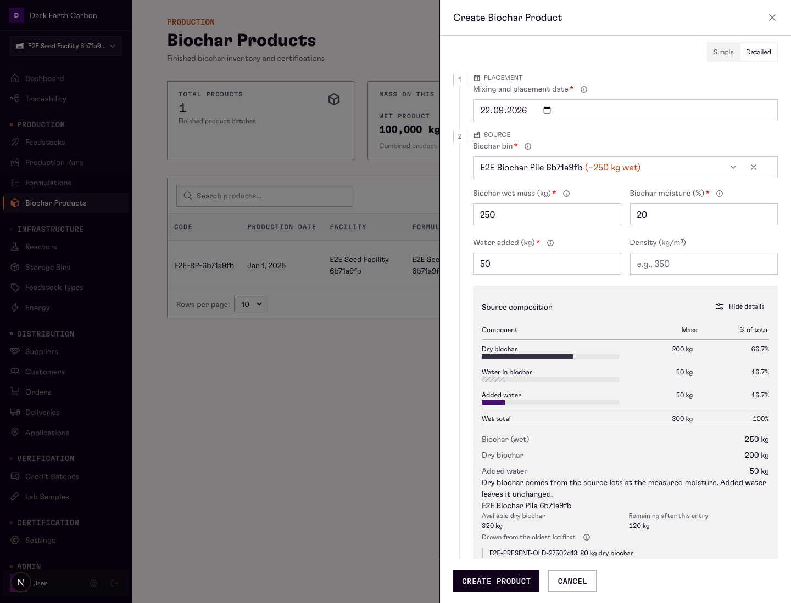
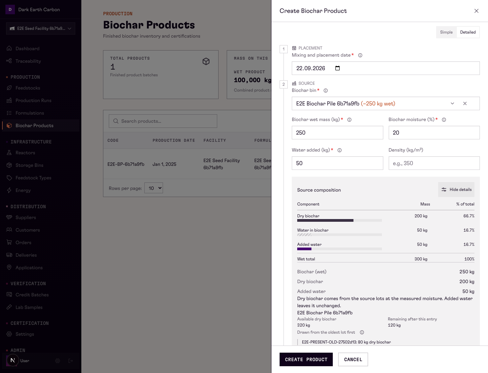
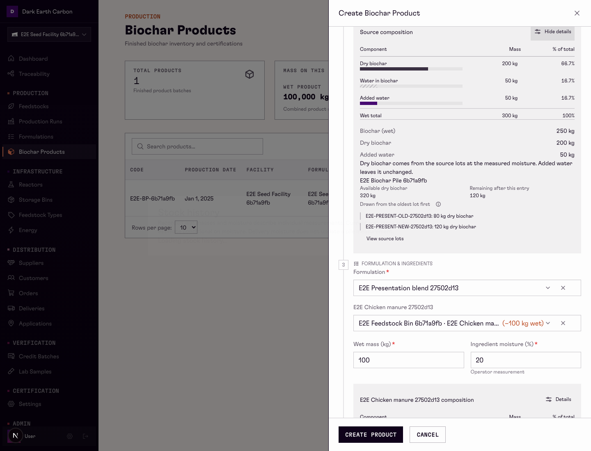
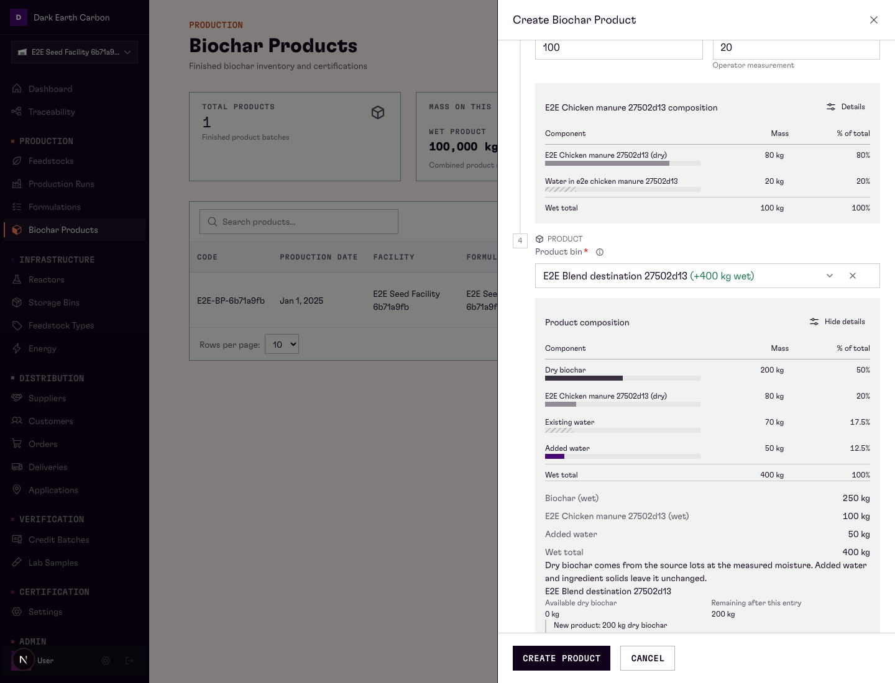
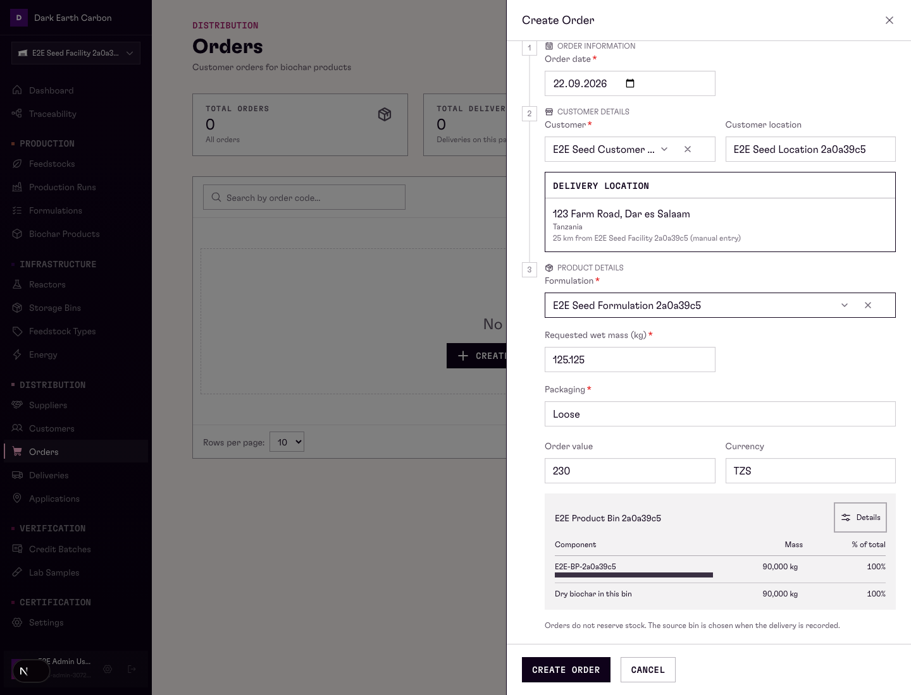
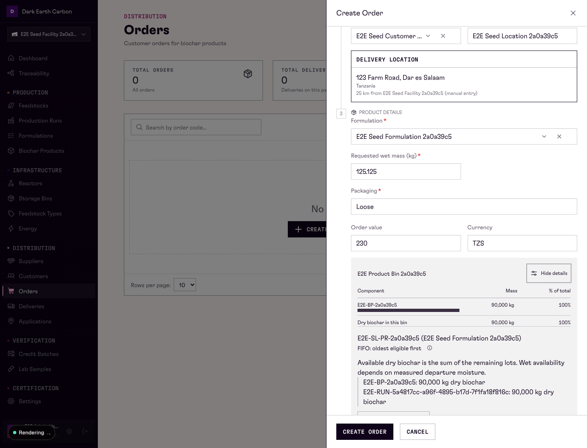

# Product and Order: approved E correction

Visual evidence for [PR #821](https://github.com/Maji-Studio/noma-dmrv/pull/821), refreshed on 2026-09-22 after restoring the approved E presentation. These images replace the earlier declutter screenshots. Application code commit: `6db75935986c1c423af456d347e773da3607fd6b`.

The authoritative reference is the preserved, uncommitted E prototype in `/private/tmp/noma-product-order-ui-prototype`, previewed at localhost:3116. The real application retains its authenticated forms and canonical calculations; reference mock data was not copied into production logic.

Simple shows inputs or recorded fields only, plus required errors and valid selector stock changes. Detailed adds source, named ingredient, and final Product composition tables. Calculation and source-lot context is behind Details. Order stock follows all form fields, grouped by bin then blend/lot.

Images are unmodified browser viewport captures: desktop 1440 × 1100, narrow 390 × 844. Each view scrolls the sheet to the relevant content. Some captures include local development indicators or success toasts. Synthetic E2E records deliberately exercise long labels; their measured masses differ from the prototype fixture.

Validation: both full presentation/FIFO specs passed (6 tests); after the final shared Details control sizing change, both presentation flows passed again (2 tests, 25.4 seconds). The complete Product flow passed again after correcting destination-addition context (1 test, 22.3 seconds). Coverage includes create/read/edit, keyboard controls, disclosure visibility, preserved values/errors, invalid and alternate bins, exact FIFO allocations, actual saves, no order stock reservation, precise read values, field alignment, and narrow overflow. Targeted ESLint and diff checks passed.

## Simple in every mode

| Surface | Desktop | Narrow |
| --- | --- | --- |
| Product create | [Fields only](product-simple-desktop.png) | [Fields only](product-simple-narrow.png) |
| Product read | [Fields only](product-read-simple-desktop.png) | [Fields only](product-read-simple-narrow.png) |
| Product edit | [Fields only](product-edit-simple-desktop.png) | [Fields only](product-edit-simple-narrow.png) |
| Order create | [Fields only](order-simple-desktop.png) | [Fields only](order-simple-narrow.png) |
| Order read | [Fields only](order-read-simple-desktop.png) | [Fields only](order-read-simple-narrow.png) |
| Order edit | [Fields only](order-edit-simple-desktop.png) | [Fields only](order-edit-simple-narrow.png) |

## Detailed in every mode

| Surface | Desktop | Narrow |
| --- | --- | --- |
| Product create | [Detailed](product-detailed-desktop.png) | [Detailed](product-detailed-narrow.png) |
| Product read | [Detailed](product-read-detailed.png) | [Detailed](product-read-narrow.png) |
| Product edit | [Detailed](product-edit-detailed.png) | [Detailed](product-edit-narrow.png) |
| Order create | [Detailed](order-detailed-desktop.png) | [Detailed](order-detailed-narrow.png) |
| Order read | [Detailed](order-read-detailed.png) | [Detailed](order-read-narrow.png) |
| Order edit | [Detailed](order-edit-detailed.png) | [Detailed](order-edit-narrow.png) |

## Composition and progressive details

Source composition below water and density

Named ingredient composition below its inputs

Source calculation and stock context

Actual FIFO source shares

Source-lot history dialog

Final product Details disclosure

Order fields followed by stock

Order stock calculation and provenance

