# Product and Order screenshot review

Visual evidence for [PR #821](https://github.com/Maji-Studio/noma-dmrv/pull/821), captured from the real application after the declutter pass (one composition table per surface, stock context as its own panel, calculation lists and repeated headers removed). Use this gallery to review the Product and Order create, read, and edit surfaces on desktop and narrow screens.

Application commit: `4b695612a3e113ec55fbbf5e5e6c4ea376217eae`.

These screenshots use synthetic local E2E records. Desktop viewport: 1440 × 1100; narrow viewport: 390 × 844. Images are unmodified full-page browser captures, so some include success toasts, the local development badge, or page content below the sheet viewport. The browser flow scrolls to the relevant fields before each capture; individual images are views of the sheet rather than stitched captures of all its content.

Validation at capture: the Product/Order presentation, FIFO, and distribution browser specs passed (16 tests), including keyboard Details controls, value preservation, actual saves, and narrow-layout overflow checks.

## Quick comparison

| Product | Order |
| --- | --- |
| [Create: Simple](product-simple-desktop.png) | [Create: Detailed](order-detailed-desktop.png) |
| [Create: Detailed](product-detailed-desktop.png) | [Field layout](order-fields-desktop.png) |
| [Read](product-read-detailed.png) | [Read](order-read-detailed.png) |
| [Edit](product-edit-detailed.png) | [Edit](order-edit-detailed.png) |
| [Narrow create](product-detailed-narrow.png) | [Narrow create](order-detailed-narrow.png) |
| [Narrow read](product-read-narrow.png) | [Narrow read](order-read-narrow.png) |
| [Narrow edit](product-edit-narrow.png) | [Narrow edit](order-edit-narrow.png) |

## Product

Create: Simple

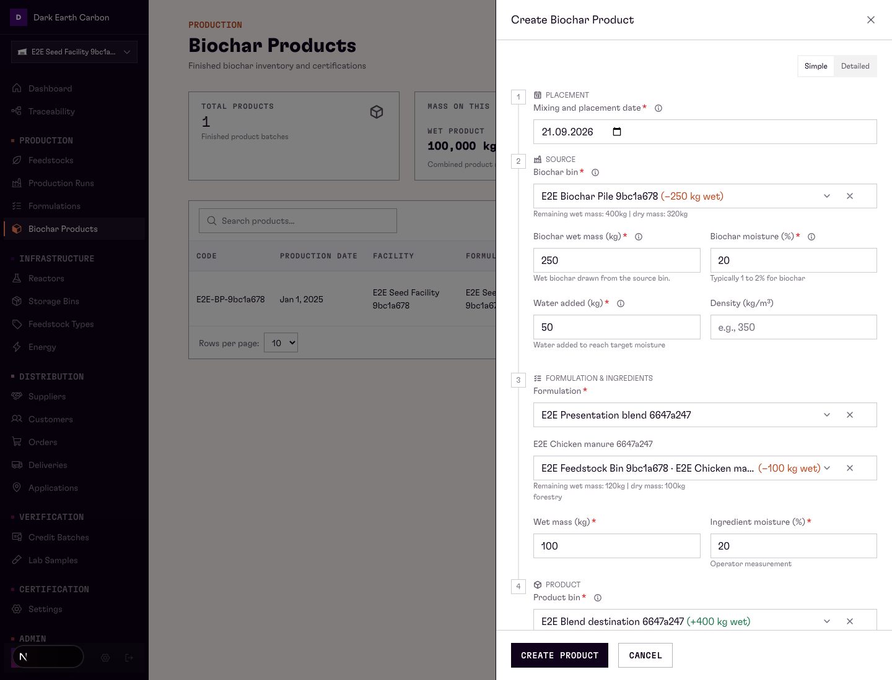

Create: Detailed with calculation context

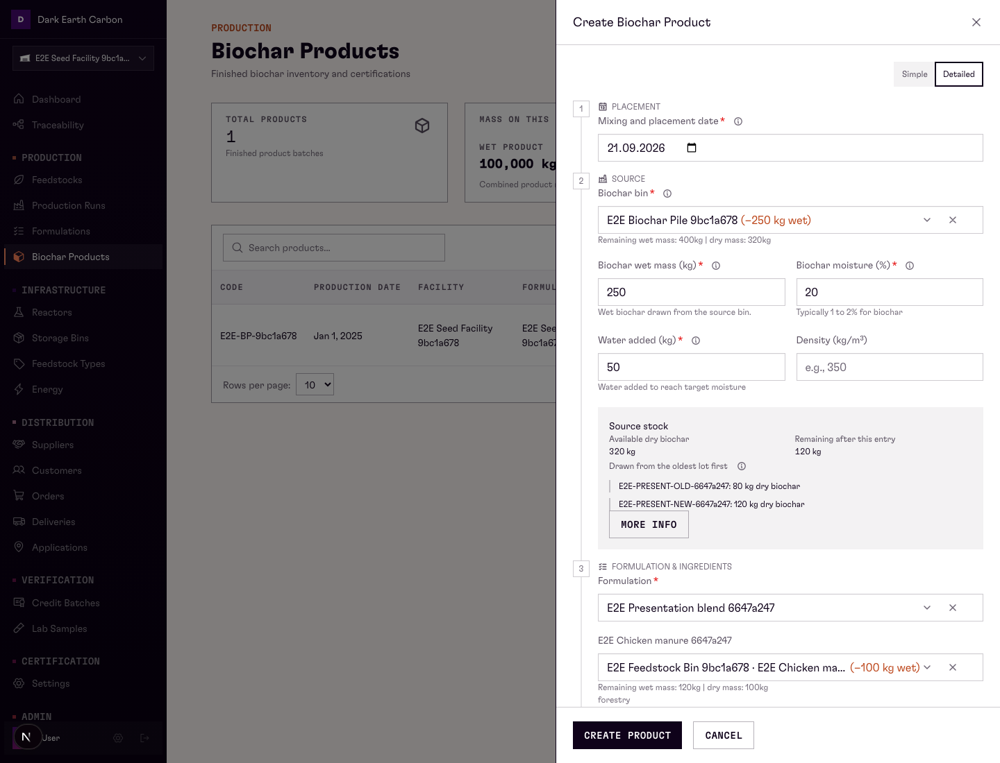

Create: Detailed, narrow

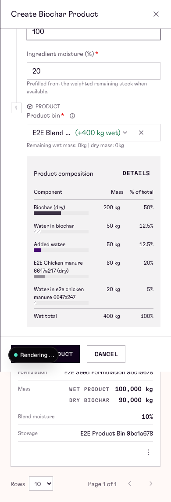

Read: saved composition

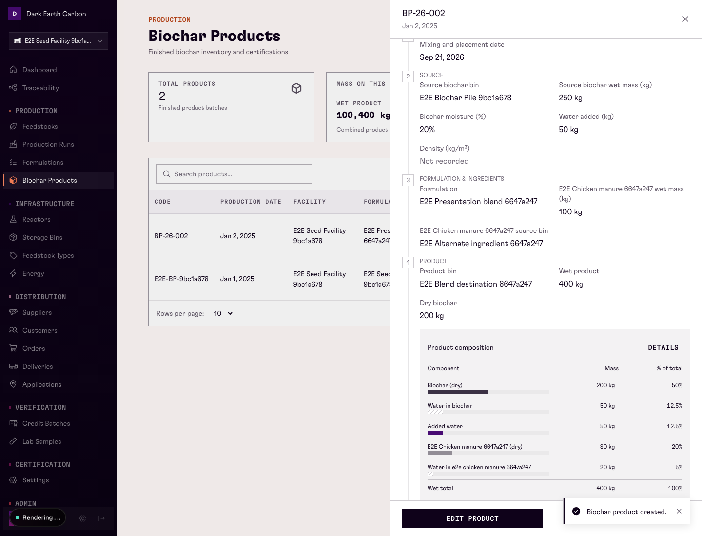

Read: narrow

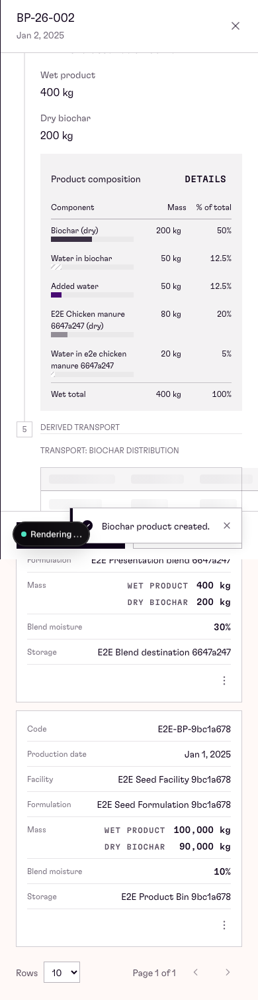

Edit: Detailed

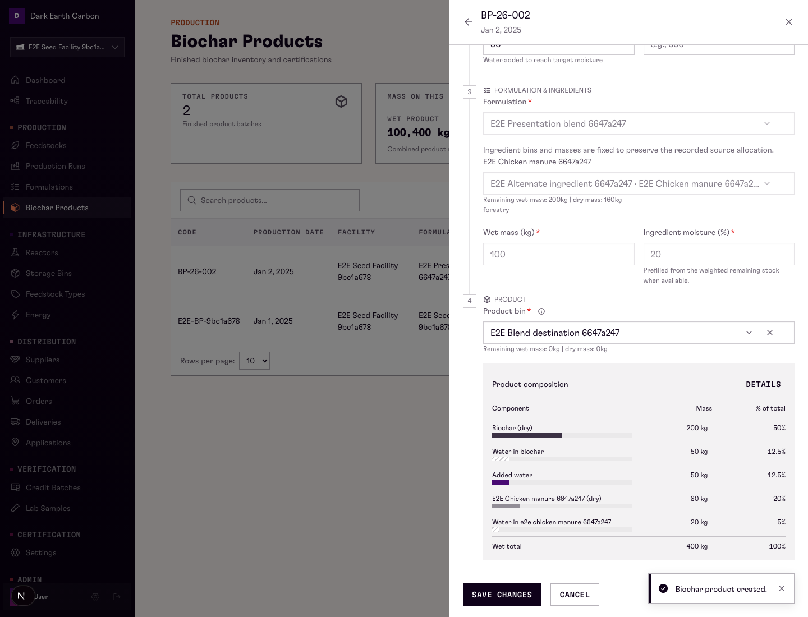

Edit: narrow

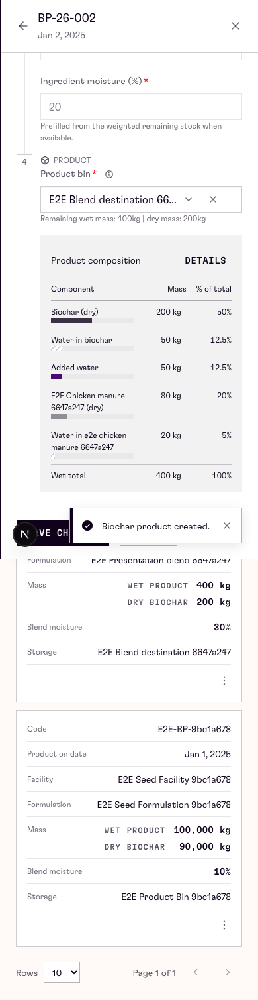

## Order

Create: Detailed stock

Create: field layout

Create: Detailed, narrow

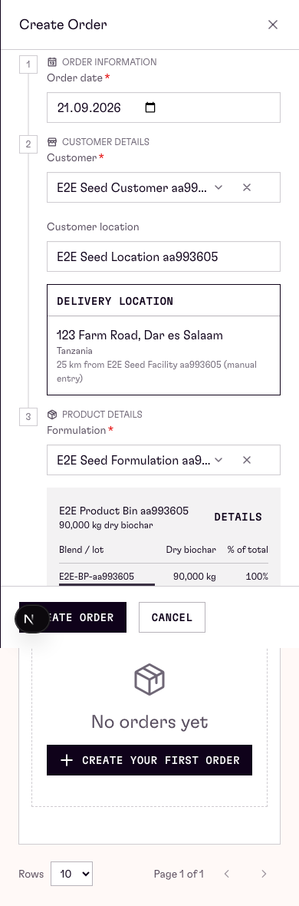

Read: current stock

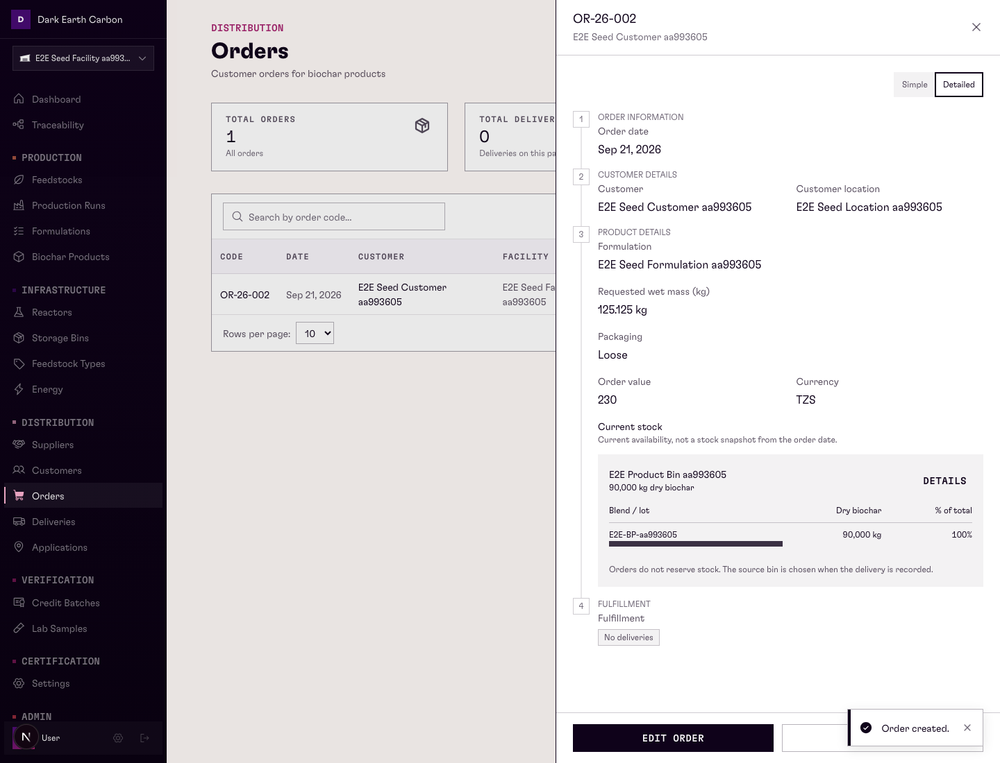

Read: narrow

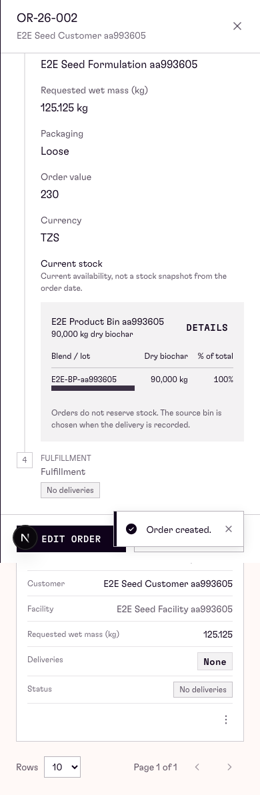

Edit: Detailed

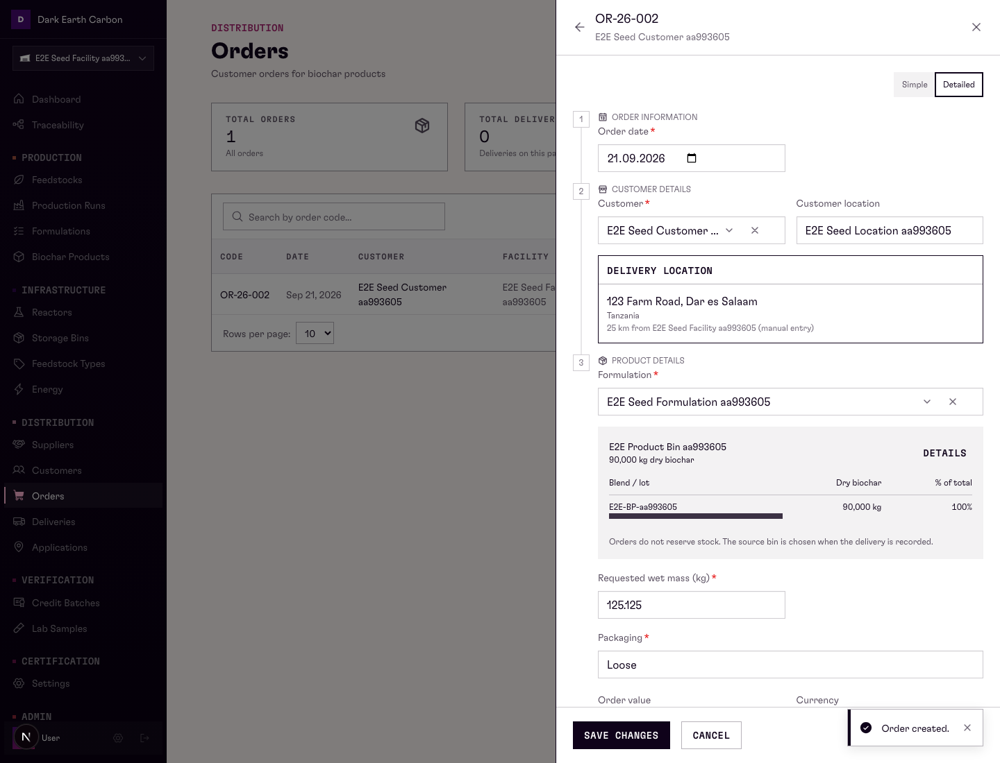

Edit: narrow

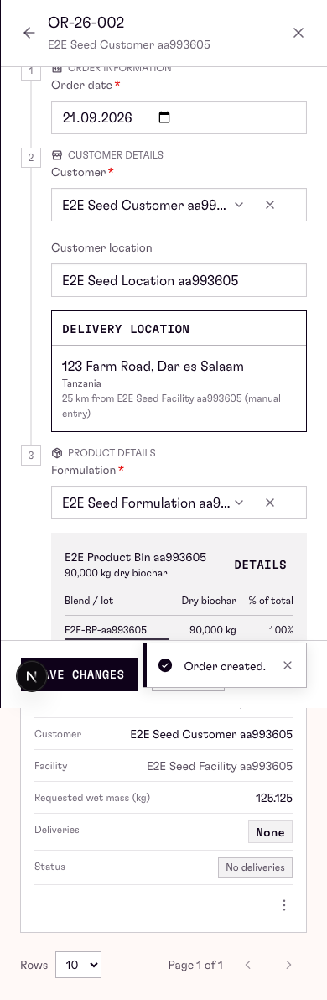

