# Form detail E gallery · 22 September 2026

Current approved E presentation, captured from the isolated localhost:3102 app using synthetic local fixtures and normal authentication. This replaces the superseded 21 September gallery. These are actual viewport screenshots, not mockups, composites, or stitched pages.

Simple contains inputs and corresponding saved fields only. Computed mass readouts, wet/dry summaries, stock estimates, provenance, and entry actions to these are absent. Actual blockers, required evidence, and approved selector adjustments remain. Detailed uses quiet tinted inline cards; component/mass/share rows use 8px bars. Details initially stays collapsed and owns calculations, provenance, and before/after context.

## Verification result

All five capture scenarios passed across the final runs: four unaffected scenarios plus a refreshed Delivery/Application scenario after removing the native selector's optional mass captions. All 116 screenshots are current. The absence checks use hard assertions.

All nine regular browser regressions passed, including real saves, FIFO shortages, read/edit presentation state, and stock corrections. The Application read assertion is scoped to the dialog so it does not match the background table header. Focused component tests (89 tests, plus 11 follow-up tests), typecheck, spacing checks, and lint passed; full lint retains 14 pre-existing warnings.

Local visual inspection against the E reference confirms the tint, compact table, 8px bars, sentence-case Details control and expanded content on representative desktop/mobile views. Simple no longer shows the Production total-input summary, Credit Batch run wet/dry readouts, or Application availability captions. No completed external model review applies to this revision: the external transfer was blocked and the started review was interrupted.

Logs: [gallery refresh](gallery-results.txt), [regression suite](regression-results.txt).

## Coverage and limits

- Delivery, Application, Feedstock and Production create/read/edit; Credit Batch read (including an applied-mass fixture); Sample transport read; stock count, loss, and correction.
- Each surface has Simple, Detailed collapsed, and representative expanded Details at 1440×1100 and 390×844. Extra images show expanded Process flow and the replacement stock card at both widths, mobile transport's right columns, the Simple shortage blocker, and saved correction history.
- Delivery/Application creation and stock count/loss/correction are submitted and persisted. Feedstock/Production create forms are populated previews; their read/edit views use seeded saved records. Read/edit captures do not claim that every edit was submitted.
- Checks cover Simple omissions (including Total wet input, Remaining wet mass, and combined Wet/Dry summaries), keyboard Enter/Space, preserved field values/save availability, clean Cancel versus dirty discard protection, and no page/dialog horizontal overflow at 390px.
- Preview quantities depend on date, stock, moisture and fixture history. Wet stock estimates do not replace recorded measurements. Dry-only batch ledgers do not invent water splits; Application keeps an honest combined ingredients/water remainder. Missing carbon data remains unavailable. Warnings and evidence gaps are intentionally retained.
- One representative disclosure opens per surface, plus the named supplemental cards. This is not an exhaustive screenshot of every scroll position or every disclosure. Sample's saved transport table scrolls horizontally within its container; both ends are captured. Tall correction modals can scroll the header out of view.

## Reproduce

The gallery is opt-in and skipped in ordinary CI. Use only the isolated local fixture environment and run serially; teardown sweeps shared E2E records. Server must already be available at localhost:3102.

```sh
source /private/tmp/noma-detail-rollout/local-test-env.sh
find docs/archive/qa/2026-09-22-form-detail-e -type f -name '*.png' -delete
rm -f docs/archive/qa/2026-09-22-form-detail-e/captures.jsonl
CAPTURE_FORM_DETAIL_GALLERY=1 pnpm exec playwright test tests/e2e/form-detail-gallery.spec.ts --workers=1 --reporter=line
```

The gallery spec is `tests/e2e/form-detail-gallery.spec.ts`. `captures.jsonl` records viewport and local route for each image. Do not run another browser suite concurrently.

116 PNGs across 18 surface/fixture groups.

## Application Create

### 1440px

| Simple | Detailed | Details expanded |
|---|---|---|
|  |  | 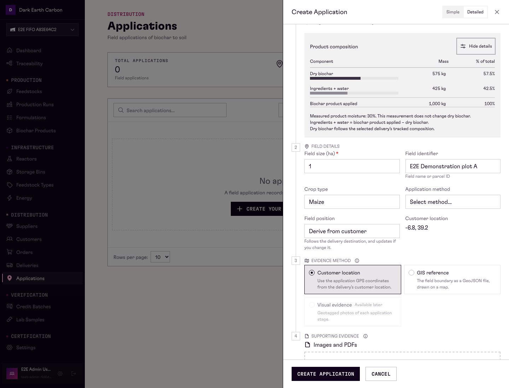 |

### 390px

| Simple | Detailed | Details expanded |
|---|---|---|
|  |  | 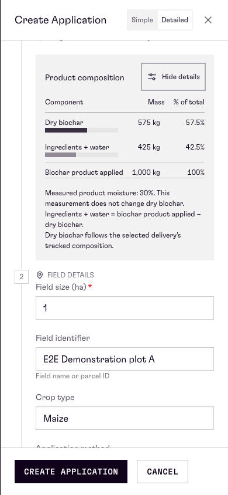 |

## Application Edit

### 1440px

| Simple | Detailed | Details expanded |
|---|---|---|
|  |  | 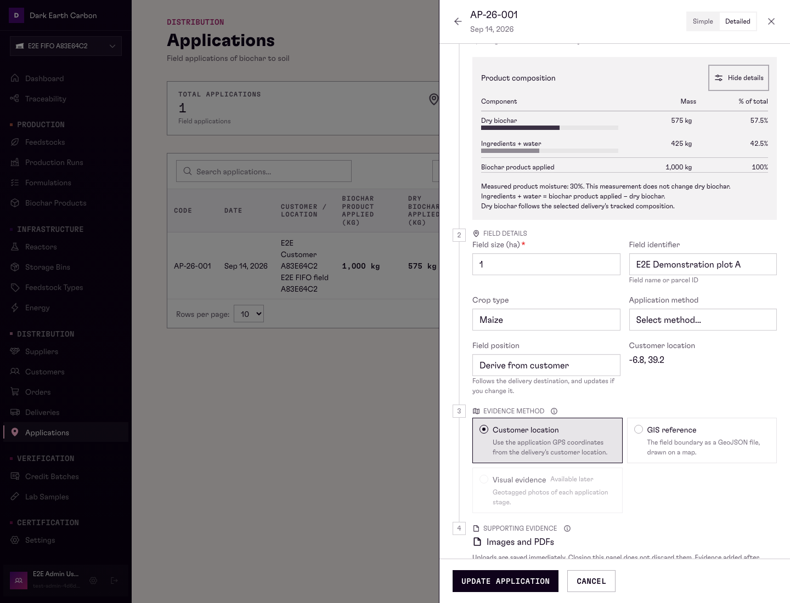 |

### 390px

| Simple | Detailed | Details expanded |
|---|---|---|
|  |  |  |

## Application Read

### 1440px

| Simple | Detailed | Details expanded |
|---|---|---|
|  |  |  |

### 390px

| Simple | Detailed | Details expanded |
|---|---|---|
|  |  |  |

## Credit Batch Applied Read

### 1440px

| Simple | Detailed | Details expanded |
|---|---|---|
|  |  | 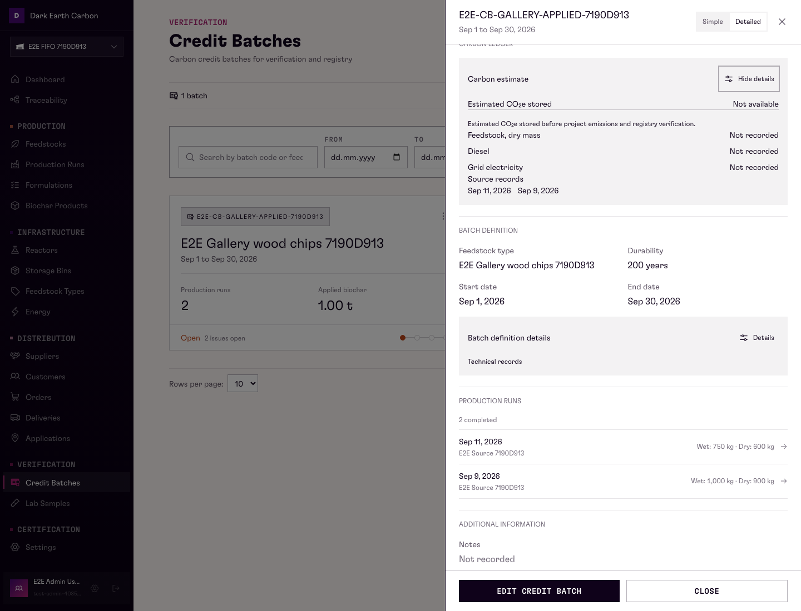 |

### 390px

| Simple | Detailed | Details expanded |
|---|---|---|
|  |  | 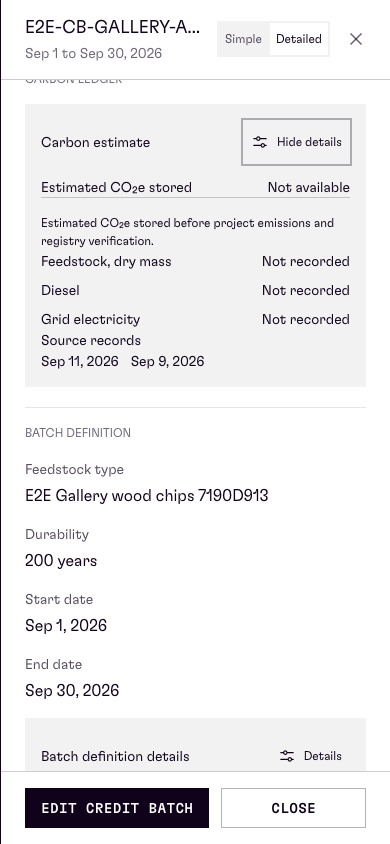 |

## Credit Batch Read

### 1440px

| Simple | Detailed | Details expanded |
|---|---|---|
|  |  | 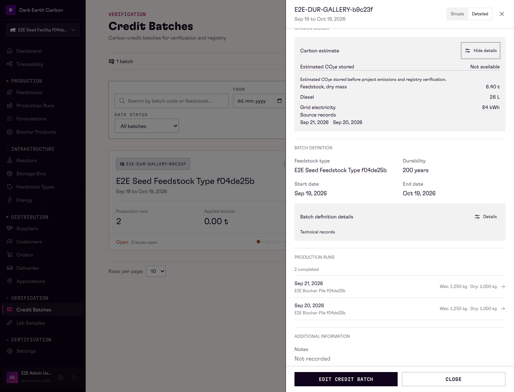 |

### 390px

| Simple | Detailed | Details expanded |
|---|---|---|
|  |  |  |

## Delivery Create

### 1440px

| Simple | Detailed | Details expanded |
|---|---|---|
|  |  |  |

### 390px

| Simple | Detailed | Details expanded |
|---|---|---|
|  |  |  |

## Delivery Edit

### 1440px

| Simple | Detailed | Details expanded |
|---|---|---|
|  |  |  |

### 390px

| Simple | Detailed | Details expanded |
|---|---|---|
|  |  |  |

## Delivery Read

### 1440px

| Simple | Detailed | Details expanded |
|---|---|---|
|  |  |  |

### 390px

| Simple | Detailed | Details expanded |
|---|---|---|
|  |  |  |

## Feedstock Create

### 1440px

| Simple | Detailed | Details expanded |
|---|---|---|
|  |  | 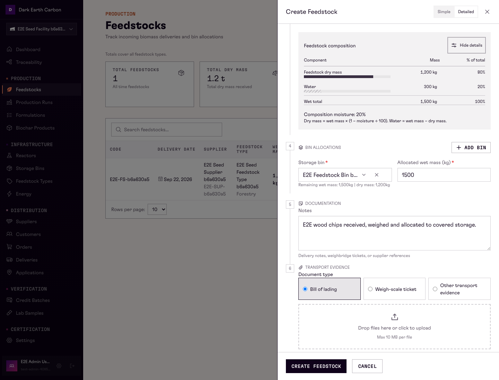 |

### 390px

| Simple | Detailed | Details expanded |
|---|---|---|
|  |  | 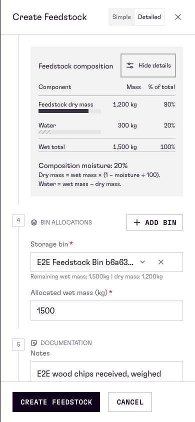 |

## Feedstock Edit

### 1440px

| Simple | Detailed | Details expanded |
|---|---|---|
|  |  | 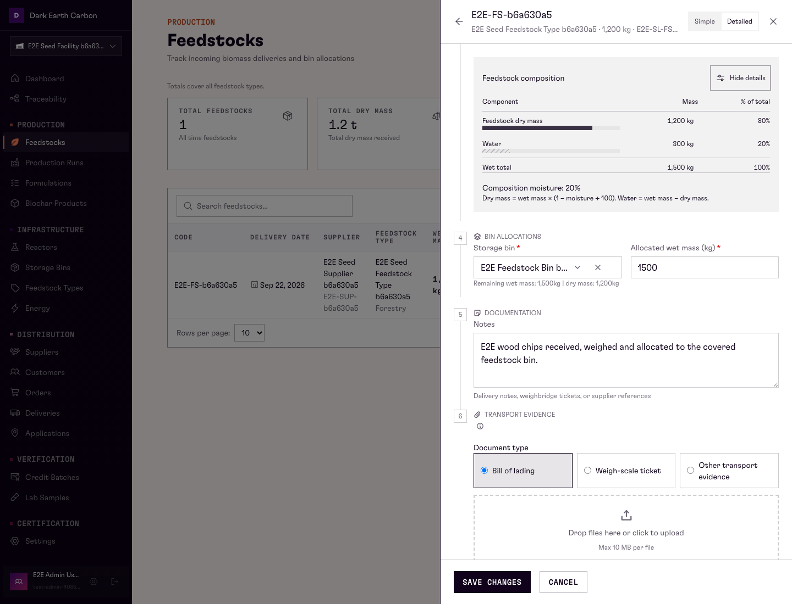 |

### 390px

| Simple | Detailed | Details expanded |
|---|---|---|
|  |  | 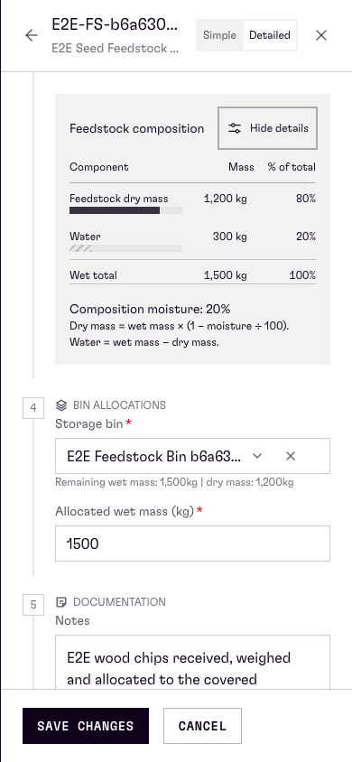 |

## Feedstock Read

### 1440px

| Simple | Detailed | Details expanded |
|---|---|---|
|  |  | 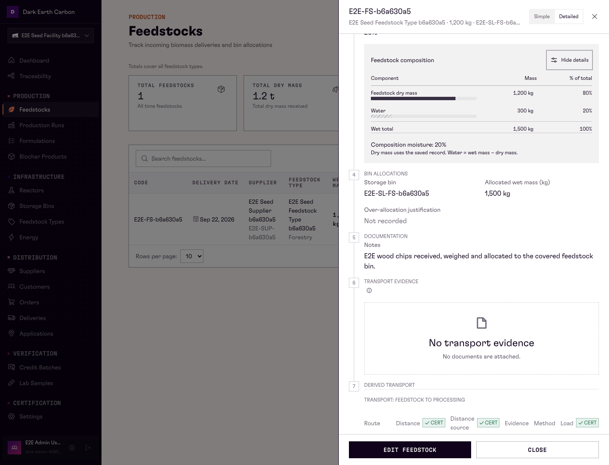 |

### 390px

| Simple | Detailed | Details expanded |
|---|---|---|
|  |  | 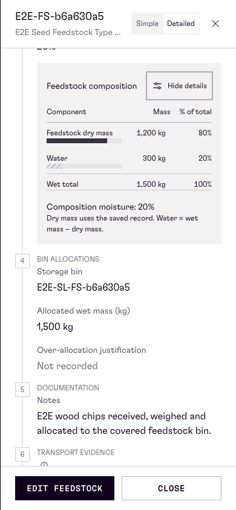 |

## Output Bin Loss

### 1440px

| Simple | Detailed | Details expanded |
|---|---|---|
|  |  |  |

### 390px

| Simple | Detailed | Details expanded |
|---|---|---|
|  |  |  |

## Output Bin Reconciliation

### 1440px

| Simple | Detailed | Details expanded |
|---|---|---|
|  |  |  |

### 390px

| Simple | Detailed | Details expanded |
|---|---|---|
|  |  |  |

## Output Stock Correction

### 1440px

| Simple | Detailed | Details expanded |
|---|---|---|
|  |  |  |

### 390px

| Simple | Detailed | Details expanded |
|---|---|---|
|  |  |  |

## Production Run Create

### 1440px

| Simple | Detailed | Details expanded |
|---|---|---|
|  |  |  |

### 390px

| Simple | Detailed | Details expanded |
|---|---|---|
|  |  |  |

## Production Run Edit

### 1440px

| Simple | Detailed | Details expanded |
|---|---|---|
|  |  |  |

### 390px

| Simple | Detailed | Details expanded |
|---|---|---|
|  |  |  |

## Production Run Read

### 1440px

| Simple | Detailed | Details expanded |
|---|---|---|
|  |  | 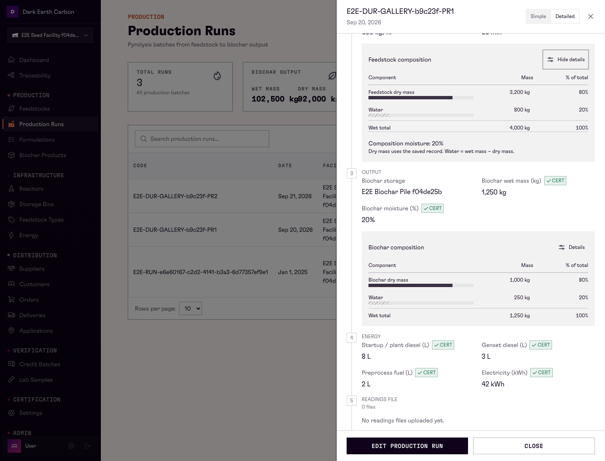 |

### 390px

| Simple | Detailed | Details expanded |
|---|---|---|
|  |  | 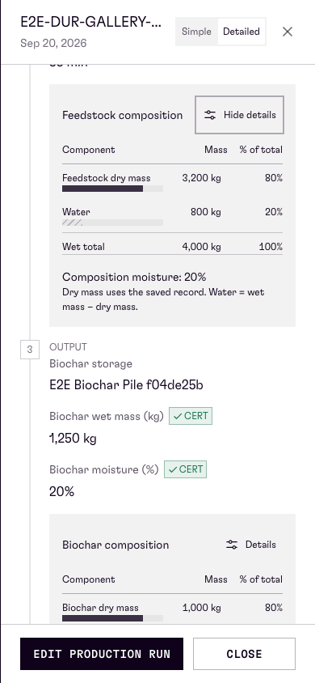 |

## Sample Read

### 1440px

| Simple | Detailed | Details expanded |
|---|---|---|
|  |  | 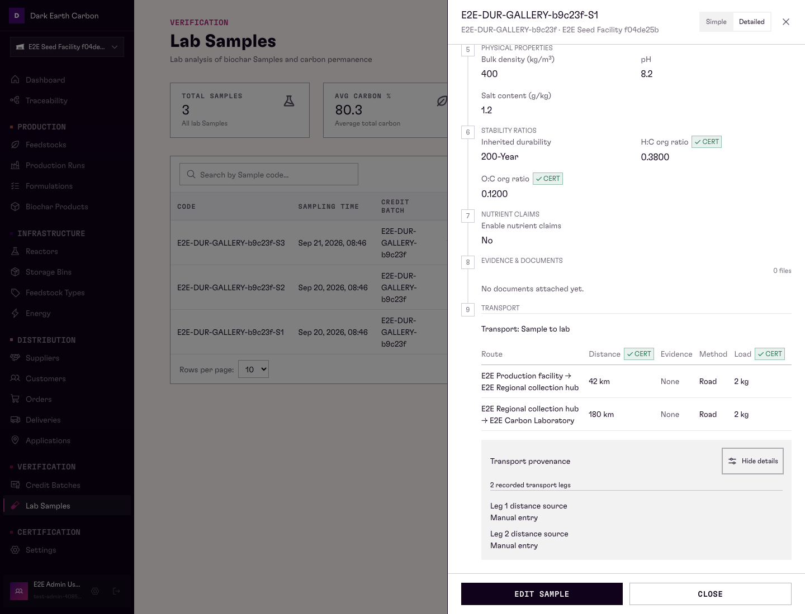 |

### 390px

| Simple | Detailed | Details expanded |
|---|---|---|
|  |  | 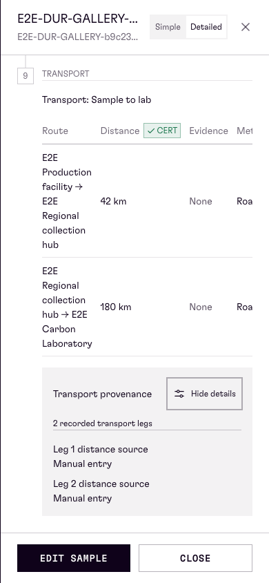 |

## Supplementary evidence

### delivery create 1440 simple blocker


### output stock correction 1440 additional details


### output stock correction 390 additional details


### output stock correction saved 1440 history


### output stock correction saved 390 history


### production run create 1440 additional details


### production run create 390 additional details


### sample read 390 transport right

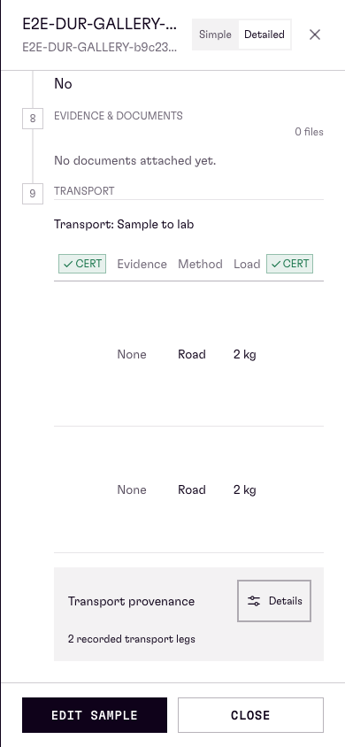
