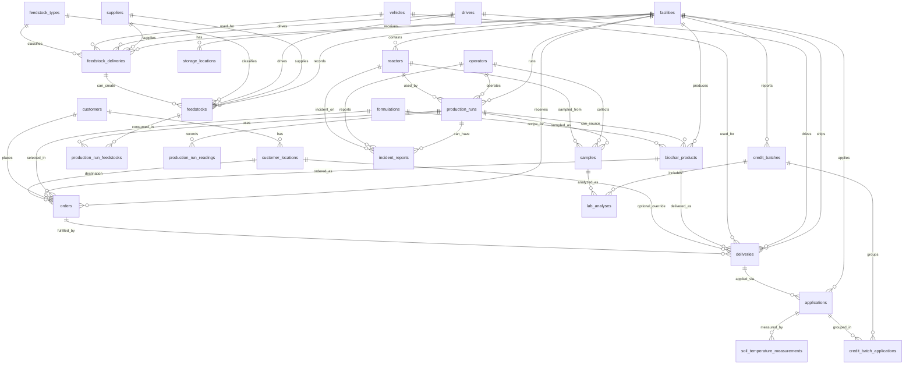
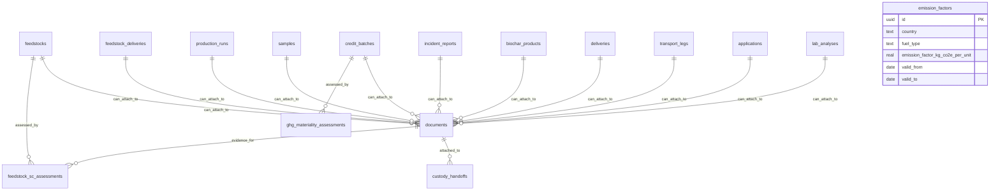
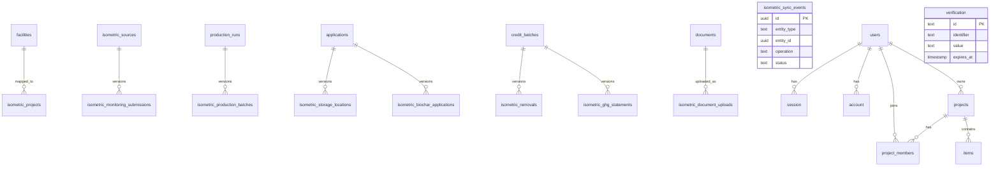

# ER Diagrams

Source of truth: `/Users/kenji/Dropbox/Maji/18 Dark Earth Carbon/noma-dmrv/src/db/schema/*.ts`

This is split into focused diagrams so relationships are legible.

## 1) Core Operations (Feedstock -> Production -> Delivery -> Application -> Credits)

## 2) Compliance, Evidence, and Emissions

Notes:
- `documents` has a DB check that enforces exactly one owner FK per row.
- `transport_legs` uses a polymorphic (`entity_type`, `entity_id`) pattern for its transported entity; it is not a strict FK to each possible source table.
- `emission_factors` is a standalone lookup/config table used by calculations.

## 3) Isometric Sync + Auth/Legacy

